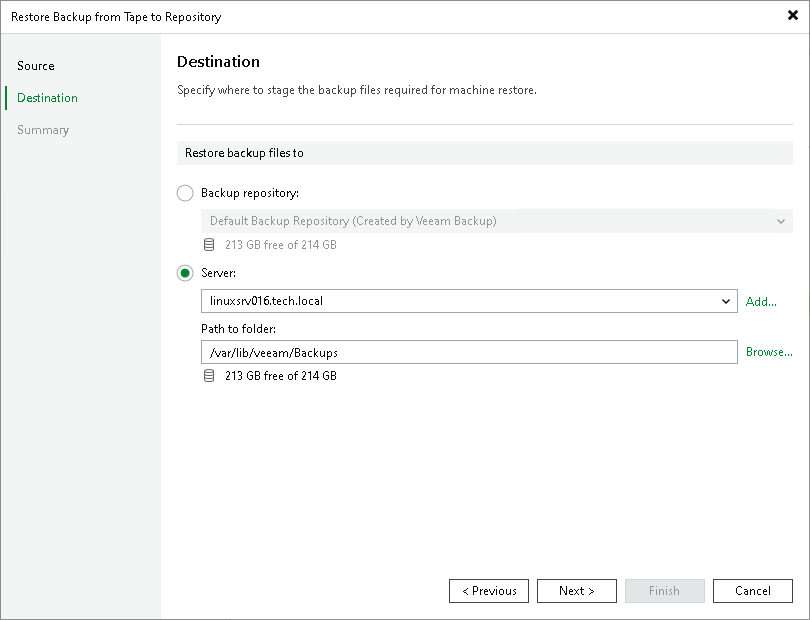

# Step 4. Choose Backup Destination

At the Destination step of the wizard, select where the backup files for the selected machines should be restored:

* To restore machine backup files to a repository, select the Backup repository option and choose the necessary repository from the list.

|  |
| --- |
| Note |
| Restoring machine backups from tapes to object storage repositories is not supported. |

* To restore machine backup files to the Veeam backup server, shared folder or to any Microsoft or Linux server connected to Veeam backup server, select the Server option. Choose the necessary server from the list and specify path to the target folder in the Path to folder field.

If you choose to restore files to a shared folder, make sure that the account under which Veeam Backup Service runs has write permissions to the target folder. If the account does not have sufficient permissions, Veeam Backup & Replication will prompt you to enter credentials for the account that can be used for writing to the target folder.

