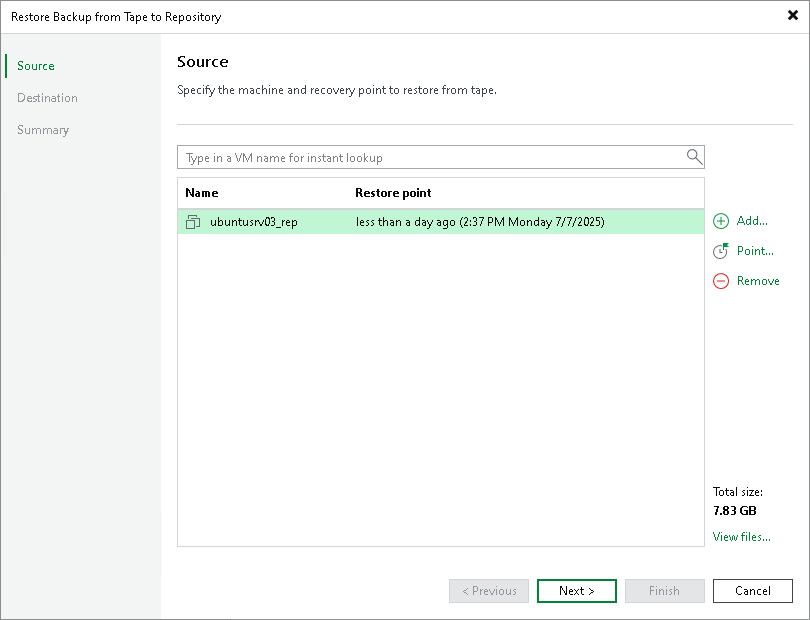

# Step 2. Choose Machines to Restore

At the Source step of the wizard, select one or more physical or virtual machines for which backup files should be restored. If you have chosen machines to restore from archives on tape, the list of objects to restore will be populated with selected machines.

To add one or more machines to the list, click Add and select where to browse for the machines:

* From vSphere infrastructure or From Hyper-V infrastructure — these options are available for VMs only. Browse the selected virtual environment and select VMs to restore. If you choose a VM container, Veeam Backup & Replication will expand it to a plain VM list. To quickly find a VM, use the search field at the bottom of the list: select what you are searching for to the left of the search bar, enter the object name or a part of it and click the search button or press [Enter].
* From backup — browse existing backups on tape and select machines under backup to tape jobs. To quickly find machines, use the search field at the bottom of the Backup Browser window: enter a virtual or physical machine name or a part of it and click the search button on the right or press [Enter].

To remove a machine, select it in the list and click Remove on the right.

