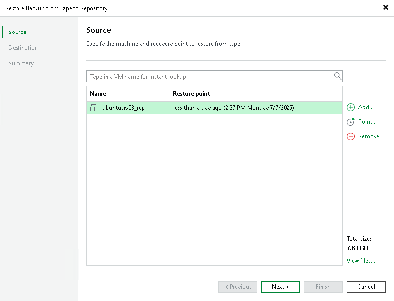
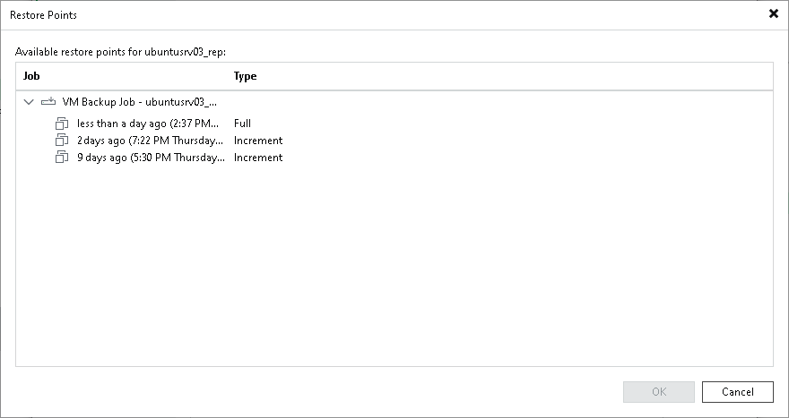

# Step 2. Choose Objects to Restore

At the Source step of the wizard, select one or more objects (VMs, physical machines, database servers) for which backup files should be restored:

* To restore VMs and physical machines, click Add and select where to browse for the machines:

* From vSphere infrastructure or From Hyper-V infrastructure — these options are available for VMs only. Browse the selected virtual environment and select VMs to restore. If you choose a VM container, Veeam Backup & Replication will expand it to a plain VM list. To quickly find a VM, use the search field at the bottom of the list: select what you are searching for to the left of the search bar, enter the object name or a part of it and click the search button or press [Enter].
  Make sure that VMs you select from the virtual environment have been successfully archived to tape at least once.
* From backup — browse existing backups on tape and select machines under backup to tape jobs. To quickly find machines, use the search field at the bottom of the Backup Browser window: enter a virtual or physical machine name or a part of it and click the search button on the right or press [Enter].

* To restore Veeam Plug-In backups, click Add and select the necessary database servers in the Backup Browser window.

To remove an object, select it in the list and click Remove on the right.

|  |
| --- |
| Important |
| Within one restore session, you can select either VMs and physical machines, or Veeam Plug-In database servers. You cannot combine restoring Veeam Plug-In backup files with other types of backups. |

By default, Veeam Backup & Replication will restore the latest restore point. However, if you want to restore a backup for the machine or database server to an earlier state, select an object in the list and click Point on the right. In the Restore Points window, select a restore point that should be used to restore the backup.

|  |
| --- |
| Note |
| [For VM and physical machine restore] If you choose a full backup point in the list, Veeam Backup & Replication will restore only this full backup. If you choose an increment, Veeam Backup & Replication will restore a chain consisting of a full backup and forward increments, necessary to restore machines to the required point-in-time. |

If you have chosen to restore multiple machines or database servers, you can select a different restore point for every object specifically.

Page updated 2026-07-16

