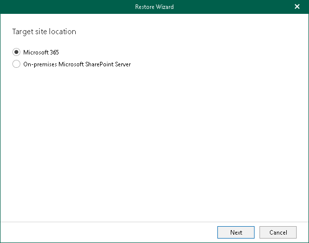

# Step 2. Select Target Site Location

At this step of the wizard, select Microsoft 365 to restore the document or list item to a SharePoint Online organization with enabled multi-factor authentication (MFA). For more information, see the [Adding Microsoft 365 Organizations](https://helpcenter.veeam.com/docs/vbo365/guide/vbo_add_office365_org.html?ver=80) section of the Veeam Backup for Microsoft 365 User Guide.

