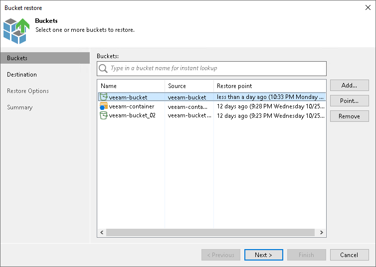

# Step 2. Select Buckets to Restore

At the Buckets step of the wizard, select the buckets or containers that you want to restore:

1. Click Add.
2. In the Backups Browser window, select the object storage backup job and a bucket or container in it that you want to restore. You can select multiple buckets or containers by holding [Ctrl] and clicking the required buckets or containers. Click OK.
3. In the Buckets table, choose the bucket or container to select a point to restore to. Click Point.
4. In the Select Restore Point window, select the restore point to which you want to restore the bucket or container. To select the required restore point, do one of the following:

* Use the Restore point slider.
* Click the date link under the Restore point slider. In the calendar in the left pane of the Select Restore Point window, select the date when the required restore point was created. The list of restore points in the right pane displays restore points created on the selected date. Select the point to which you want to restore the bucket or container.

In the Files in backup tree, you can see what prefixes and objects are covered by the selected restore point and the date when each of them was modified.

Click OK.

To quickly find a bucket or container, you can use the search field at the top of the window. Enter a bucket or container name or a part of it in the search field and press [Enter].

To exclude the bucket or container from the restore process, select the bucket or container in the table and click Remove.

