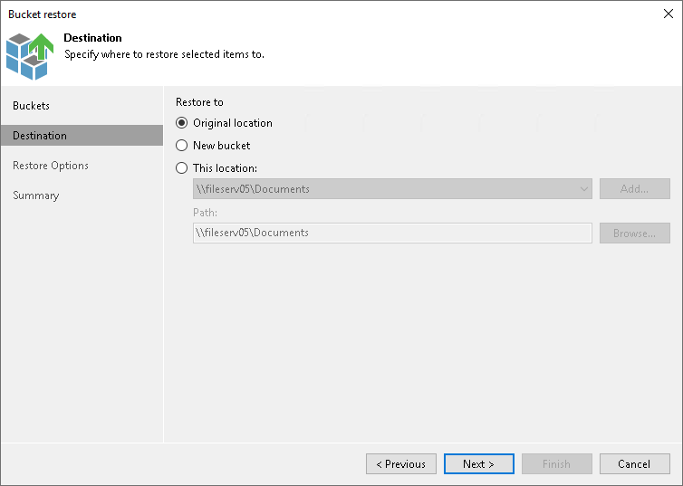

# Step 3. Specify Destination for Bucket or Container Restore

In this article

At the Destination step of the wizard, specify the location where you want to restore the bucket or container.

* Select Original location to restore data to the location where it resided originally. This type of restore is only possible if the original device is connected to Veeam Backup & Replication and powered on.
* Select New bucket to create a new bucket or container and restore the backed-up bucket or container content to it. You can restore only a single bucket or container to a new bucket or container.

|  |
| --- |
| Note |
| The target location where you want to restore the bucket or container has the following limitations:   * You can restore backups of Amazon S3 and s3 compatible only to a new bucket located either in Amazon S3 or S3 compatible object storage. * You can restore backups of Microsoft Azure Blob Storage only to a new container in Microsoft Azure Blob Storage. |

* Select This location to restore data to another location:

1. In the This location field, select a location to restore objects to. You can select any object storage added to the backup inventory. If the required location is missing in the drop-down list, click Add and add a new location to Veeam Backup & Replication. For more information, see the [Adding Unstructured Data Source](adding_unstructured_data_source.md) section.
2. In the Path field, specify a path to the prefix in the selected location to restore objects to.

To select a specific prefix, click Browse. In the Select Folder window, select the target location for the bucket or container content.

Page updated 6/3/2024

Page content applies to build 13.0.1.1071
