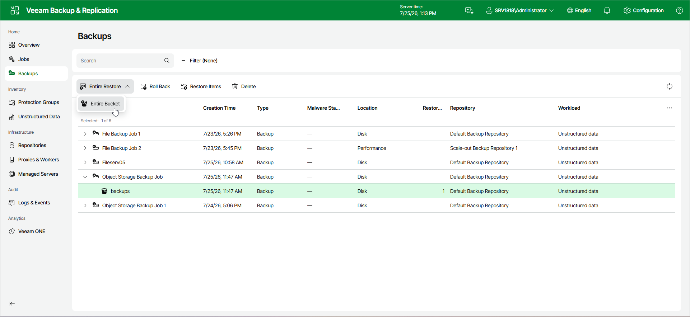

# Step 1. Launch Bucket Restore Wizard

To launch the Restore Entire Object Storage wizard, do the following:

1. In the management pane, click the Backups node.
2. In the working area, expand the necessary backup.
3. Click Entire Restore on the ribbon.
4. From the drop-down list, select Entire Bucket.

Alternatively, right-click the bucket that you want to restore and select Entire Restore > Entire Bucket.

Page updated 2026-07-27

