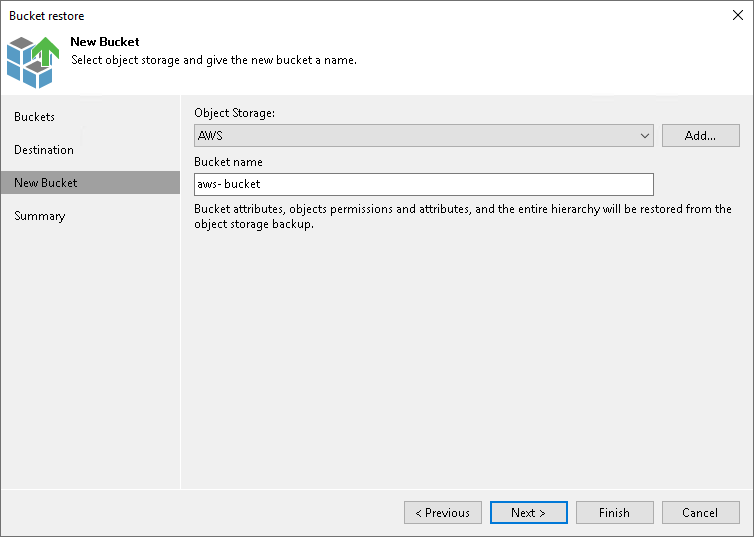

# Step 4. Create New Bucket or Container

The New Bucket step is available if you select the New bucket option at the [Destination](restore_entire_bucket_destination.md) step.

At the New Bucket step of the wizard, create a new bucket or container where you want to restore the bucket or container.

1. From the Object storage drop-down list, select an object storage where you want to create a new bucket or container. If the required object storage is missing in the drop-down list, click Add and add a new object storage to the Veeam Backup & Replication inventory. For more information, see the [Adding Object Storage](adding_object_storage.md) section.

|  |
| --- |
| Note |
| The target bucket or container where you want to restore the data has the following limitations:   * You can restore backups of Amazon S3 and s3 compatible only to a new bucket located either in Amazon S3 or S3 compatible object storage. * You can restore backups of Microsoft Azure Blob Storage only to a new container in Microsoft Azure Blob Storage. |

1. In the Bucket name, specify the name for the bucket or container following bucket or container naming rules for the selected object storage.

