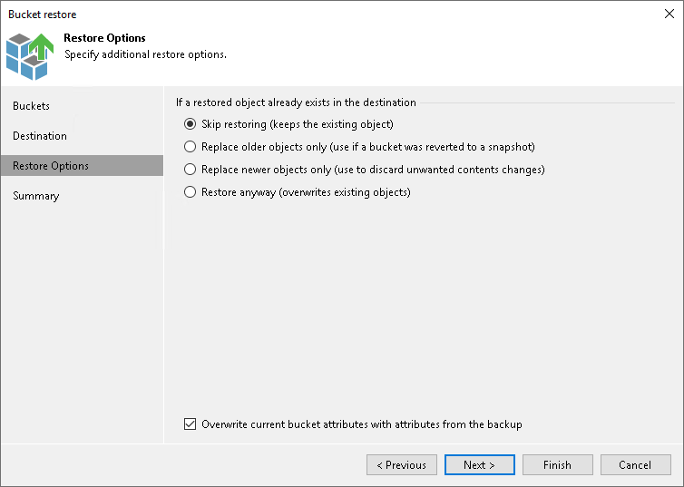

# Step 5. Specify Restore Options

The Restore Options step is available if you select either the Original location option or the This location option at the [Destination](restore_entire_bucket_destination.md) step.

At the Restore Options step of the wizard, specify overwrite options in case the bucket or container with the same name already exists in the target location:

* Skip restoring (keeps the existing object). Select this option if you do not want to overwrite the existing objects with the restored objects.
* Replace older objects only (use if a bucket was reverted to a snapshot). Select this option if you want to overwrite the existing objects only if they are older than the restored objects.
* Replace newer objects only (use to discard unwanted contents changes). Select this option if you want to overwrite the existing objects only if the restored objects are older than the source objects.
* Restore anyway (overwrites existing objects). Select this option if you want to overwrite the existing objects with the restored objects in all cases.

Select the Overwrite current bucket attributes with attributes from the backup check box if you want the target bucket or container to inherit attributes from the restored bucket or container.

|  |
| --- |
| Note |
| Note that you can select this check box only when restoring to original location. |

