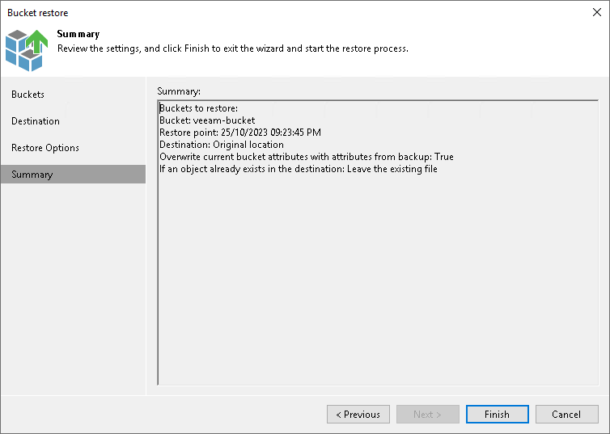

# Step 6. Finish Working with Wizard

In this article

At the Summary step of the wizard, review the bucket or container restore settings and click Finish. Veeam Backup & Replication will restore the bucket or container to the specified location.

Page updated 11/27/2023

Page content applies to build 13.0.1.1071
