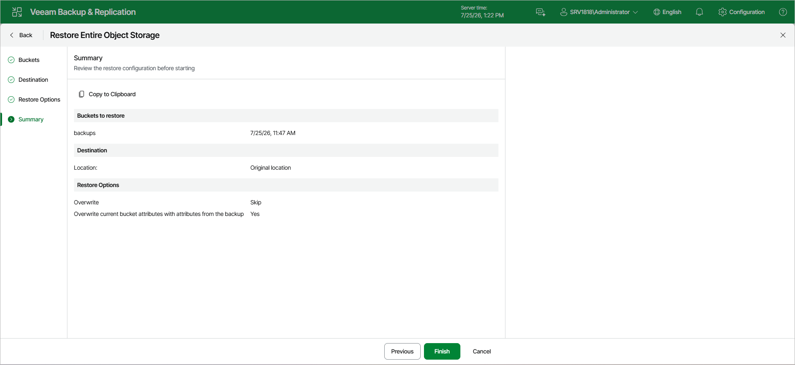

# Step 6. Finish Working with Wizard

At the Summary step of the wizard, review the bucket or container restore settings and click Finish. Veeam Backup & Replication will restore the bucket or container to the specified location.

Page updated 2026-07-25

