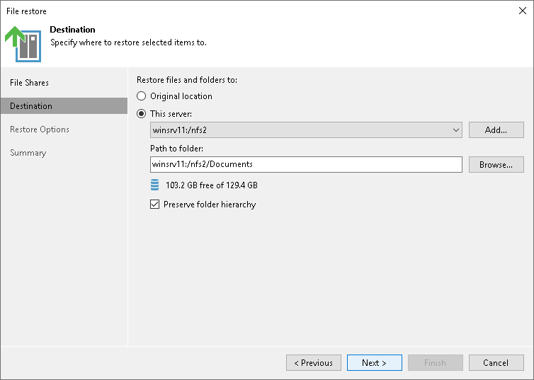

# Step 3. Specify Destination for Data Restore

At the Destination step of the wizard, specify the location where you want to restore the file share.

* Select Original location to restore data to the location where it resided originally. This type of restore is only possible if the original device is connected to Veeam Backup & Replication and powered on.
* Select This server to restore data to another location:

1. In the This server field, select a file share to restore files to. You can select any file share added to the backup inventory. If the required file share is missing in the drop-down list, click Add and add a new file share to Veeam Backup & Replication. For more information on how to add a new file share, see [Adding Unstructured Data Source](adding_unstructured_data_source.md).
2. In the Path to folder field, specify a path to the folder on the selected file share to restore files to.

To select a specific folder on the file share to restore files to, click Browse. In the Select Folder window, select the target location for the file share.

If you want to restore the file share to a new folder, click New Folder at the bottom of the window, enter the folder name and click OK to confirm the new folder creation.

1. Select Preserve folder hierarchy to keep the folder hierarchy of the original file share in the new location.

