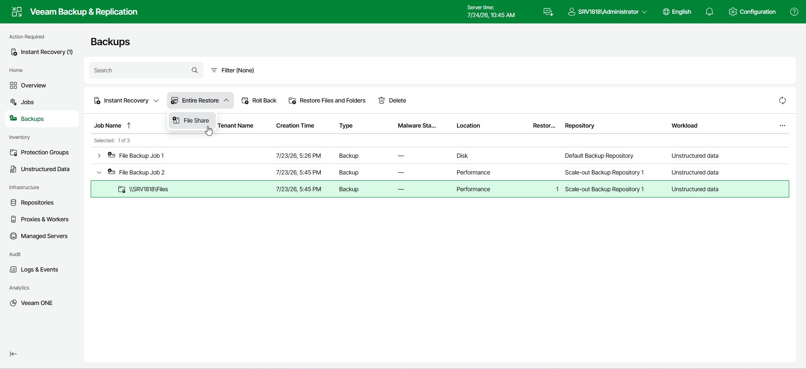

# Step 1. Launch File Restore Wizard

To launch the Restore Entire File Share wizard, do the following:

1. In the management pane, click the Backups node.
2. In the working area, expand the necessary backup.
3. Click Entire Restore on the ribbon.
4. From the drop-down list, select File Share.

Alternatively, right-click the file share that you want to restore and select Entire Restore > File Share.

Page updated 2026-07-27

