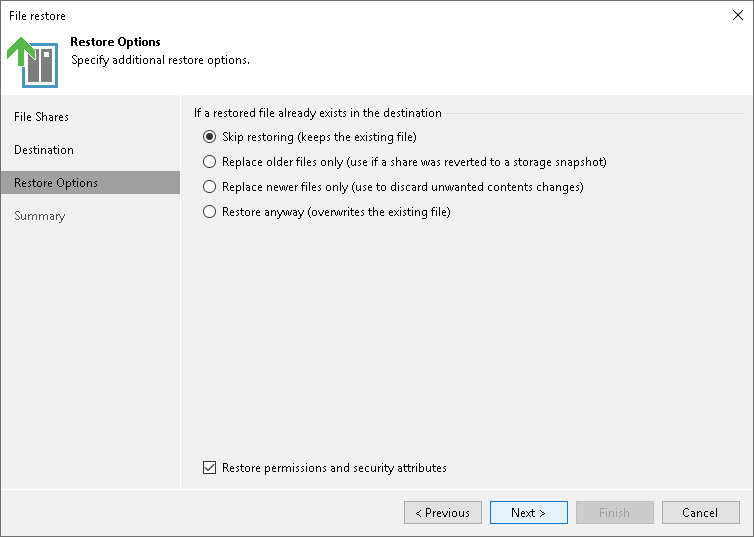

# Step 4. Specify Restore Options

In this article

At the Restore Options step of the wizard, specify overwrite options in case the file with the same name already exists in the target folder:

* Skip restoring (keeps the existing file). Select this option if you do not want to overwrite the existing file with the restored one.
* Replace older files only (use if a share was reverted to a storage snapshot). Select this option if you want to overwrite the existing file only if it is older than the restored file.
* Replace newer files only (use to discard unwanted contents changes). Select this option if you want to overwrite the existing file only if the restored file is older than the source share file.
* Restore anyway (overwrites the existing file). Select this option if you want to overwrite the existing file with the restored file in all cases.

Select the Restore permissions and security attributes check box if you want the restored files to keep their original ownership and security permissions. If you do not select this check box, Veeam Backup & Replication will change security settings. The user account under which the Veeam Backup Service runs will be set as the owner of the restored objects. Access permissions will be inherited from the target folder to which the objects are restored.

|  |
| --- |
| Note |
| Consider that Veeam Backup & Replication does not collect ACL handling settings of the source file share root folder, so you cannot restore them. Before restoring an entire file share, you will have to specify required ACL handling settings for the root folder of the target file share. |

Page updated 6/3/2024

Page content applies to build 13.0.1.1071
