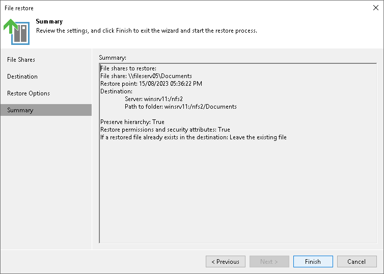

# Step 5. Finish Working with Wizard

At the Summary step of the wizard, review the file share restore settings and click Finish. Veeam Backup & Replication will restore the file share to the specified location.

