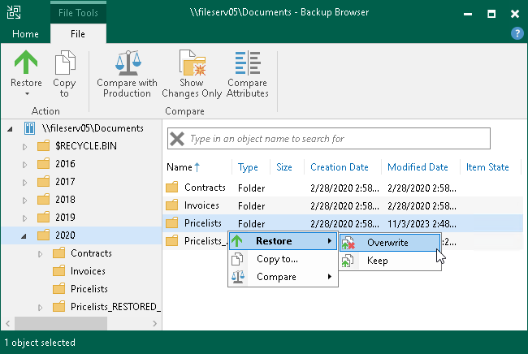
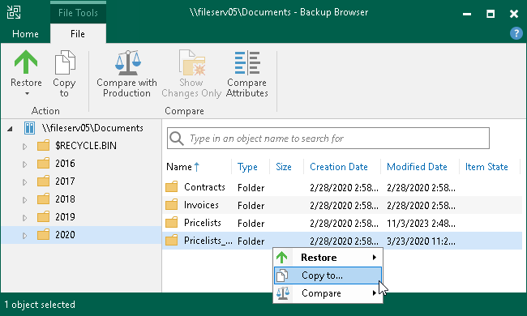
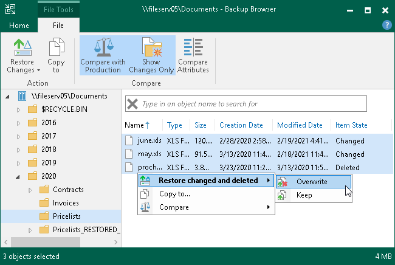
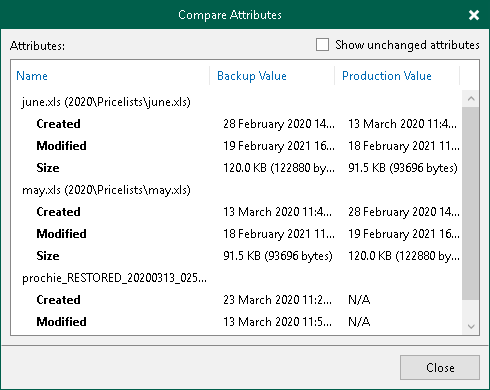

# Step 4. Select Files and Folders to Restore

In the Backup Browser, select files and folders to restore. Backup browser has three representations of restore points. You can select one of the following options in the Restore Point group on the ribbon to display file versions:

* Latest — the Backup Browser shows the latest versions of files and folders on the file share.
* All Time — the Backup Browser shows all files and folders ever backed up by the backup job. This option retrieves file versions stored both in the backup and archive repositories. This representation additionally shows how many file versions of each file are stored in the backup and the date when the latest file version was created.

After you select this option:

* If you restore a whole folder, you will be prompted to the [Select Restore Point to Use](restore_files_folders_restore_point.md) step to select a restore point to restore files from.

|  |
| --- |
| Note |
| Consider that during file-level restore you cannot restore whole folders from the archive restore points. If the files are already moved to the archive repository, you have to restore them one by one. |

* If you restore a single file, you will be prompted to the [Select File Version to Restore](restore_files_folders_file_version.md) step to select a file version to restore the file from.

* Selected — the Backup Browser shows versions of files and folders backed up as of the certain restore point. Select the restore point in the list on the right of the Selected option on the ribbon.

You can use the search field at the top of the working area to search for specific files and folders.

|  |
| --- |
| Note |
| To keep the operation of the Backup Server stable, the number of retrieved search result records is limited to 1000. Therefore, if you work with backup folders that store large volumes of data, it is recommended to narrow the search criteria to fit into the limitation. |

You can restore files and folders to their original location or a new location.

Restoring Files to Original Location

To restore files and folders to the original location, in the Veeam Backup browser right-click a file or folder and select one of the following commands:

* To overwrite the original file on the file share with the file restored from the backup, select Restore > Overwrite.
* To save the file restored from the backup next to the original file, select Restore > Keep.

Veeam Backup & Replication will add the \_RESTORED\_YYYYMMDD\_HHMMSS suffix to the original file name and store the restored file in the same folder where the original file resides.

Alternatively, you may use similar options under Restore in the ribbon.

Saving Files to New Location

To save files and folders to a new location, right-click the necessary file or folder and select Copy to. Alternatively, you may use the Copy to option in the ribbon.

If you restore files and folders to a new location, you will be prompted to the [Specify Destination for File Restore](restore_files_folders_destination.md) step to specify a new destination.

Comparing Backup File and Folder Versions with Production Objects

|  |
| --- |
| Note |
| The compare with production feature does not work if you select the All Time option at the Home tab of the Backup Browser. |

You can compare backup versions of specific files and folders with their production sources. To compare them, do the following:

1. Select a folder in the file tree in the left pane or a folder or file in the right pane. You can use [Ctrl] to select multiple objects in the right pane.
2. Right-click the selected objects and select Compare > Compare. Alternatively, click Compare with Production on the ribbon.

After the comparison, files and folders will have the following comparison states in the Item State column: changed, unchanged, deleted, comparing, or failed to compare. The states are updated when you turn off and then turn on the comparison mode, and when you start restoring changes of files and folders. Note that when comparing symbolic links, Veeam Backup & Replication compares attributes of the links, not the attributes of files and folders which the symbolic link points to.

|  |
| --- |
| Tip |
| To show only changed files and folders (in the changed and deleted states), perform the compare operation, right-click any area in the Veeam Backup browser and select Compare > Show changes only or click Show Changes Only on the ribbon. To show all files and folders, click the Show changes only option once again.  To switch off the comparison states, select an item in the comparison state and click Compare > Compare or click Compare with Production on the ribbon. Note that if you switch off comparison for child files and folders, comparison for parent folders will also be switched off. |

Restoring Changed Files and Folders

After you run the compare with production session, you can restore the changed and deleted objects. To restore them to the original location, in the Veeam Backup browser right-click a file or folder with Changed or Deleted item state and select one of the following commands:

* To overwrite the original object on the object storage with the object restored from the backup, select Restore changed and deleted > Overwrite.
* To save the object restored from the backup next to the original object, select Restore changed and deleted > Keep.

Veeam Backup & Replication will add the \_RESTORED\_YYYYMMDD\_HHMMSS suffix to the original object name and store the restored object in the same folder where the original object resides.

Alternatively, you may use similar options under Restore Changes in the ribbon.

You can view which attributes were changed for files and folders:

1. Select the necessary files and folders in the file system tree or in the details pane on the right.
2. Right-click one of the selected items and select Compare > Compare attributes or click Compare Attributes on the ribbon.

In the Compare Attributes window, Veeam Backup & Replication shows changed attributes. If you want to show all attributes, click the Show unchanged attributes check box at the top right corner. Note that Veeam Backup & Replication shows attributes maximum for 500 files and folders and shows attributes for the selected files and folders, not for the nested files.

