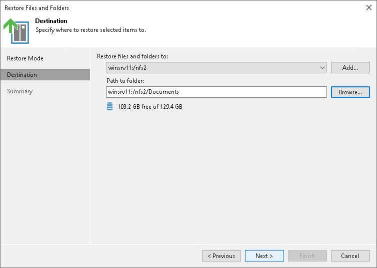

# Step 8. Specify Destination for File Restore

The Destination step is required if you choose the Copy To option at the [Select Files and Folders to Restore](restore_files_folders_backup_browser.md) step. Specify the destination where the restored files must be stored:

1. In the Restore files and folders to field, select a file share to which the files must be restored. All file shares added to the inventory of Veeam Backup & Replication are available. If the required file share is missing in the drop-down list, click Add and add a new file share to Veeam Backup & Replication.

For more information on how to add a new file share, see [Adding Unstructured Data Source](adding_unstructured_data_source.md).

1. In the Path to folder field, specify a path to the folder on the selected file share where files must be restored.

To create a dedicated folder for restored files, click Browse. In the Select Folder window, select the target location for the file share.

If you want to restore the file share to a new folder, click New Folder at the bottom of the window. Confirm the new folder creation.

