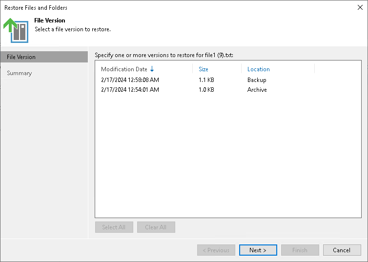

# Step 7. Select File Version to Restore

The File Version step is required if you use the All Time option at the [Select Files and Folders to Restore](restore_files_folders_backup_browser.md) step and the selected files have more than one file version.

If at the [Backup Browser](restore_files_folders_backup_browser.md) step you have selected to keep original objects, select one or more versions to restore. You can restore files both from the backup repository and archive repository. To select several file versions, hold [Ctrl] and select multiple records in the table. Restore of multiple file versions can be helpful, for example, when you need to search for a specific version of the file, but you do not know for sure which one contains required changes.

If at the [Backup Browser](restore_files_folders_backup_browser.md) step you have selected to overwrite original objects, you can select only one version to restore.

