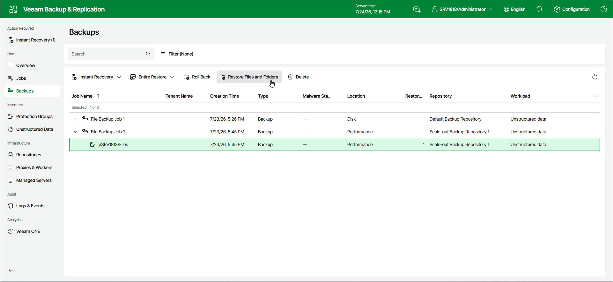

# Step 1. Launch File Restore Wizard

To launch the Restore Entire File Share wizard, do the following:

1. In the management pane, click the Backups node.
2. In the working area, expand the necessary backup.
3. Click Restore Files and Folders on the ribbon.

Alternatively, right-click the file share that you want to restore and select Restore Files and Folders from the drop-down menu.

Page updated 2026-07-27

