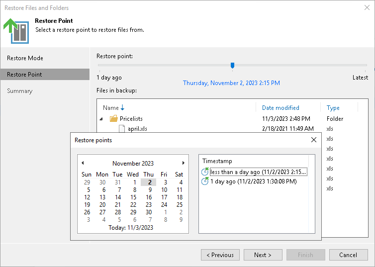

# Step 6. Select Restore Point

In this article

The Restore Point step is required if you use the All Time option at the [Select Files and Folders to Restore](restore_files_folders_backup_browser.md) step, the selected folders have more than one restore point, and you select the Earlier restore point option at the [Restore Mode](restore_files_folders_restore_mode.md) step.

At the Restore Point step of the wizard, select the point in time to restore folders to. To select the required restore point, do one of the following:

* Use the Restore point slider.
* Click the date link under the Restore point slider. In the calendar in the left pane of the Restore points window, select the date when the required restore point was created. The list of restore points in the right pane displays restore points created on the selected date. Select the point to which you want to restore the files and folders.

In the Files in backup tree, you can see what folders and files are covered by the selected restore point and the date when files and folders were modified.

Page updated 11/22/2023

Page content applies to build 13.0.1.1071
