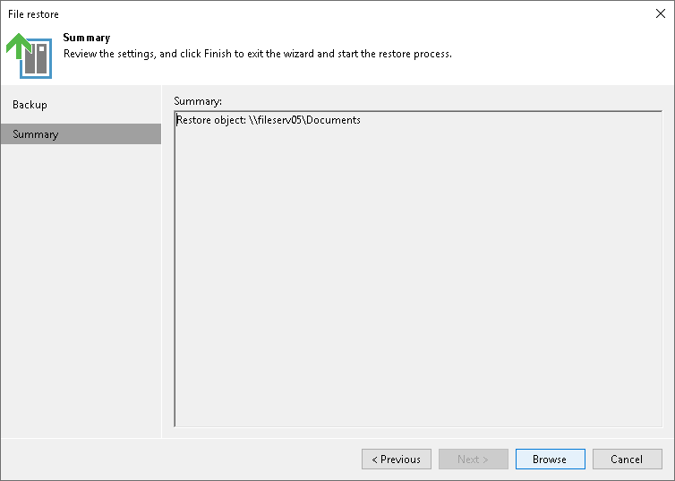

# Step 3. Verify Object Restore Settings

In this article

At the Summary step of the wizard, review selected restore object and click Browse to switch to the [Backup Browser](restore_files_folders_backup_browser.md) step and select files and folders to restore.

Page updated 11/9/2023

Page content applies to build 13.0.1.1071
