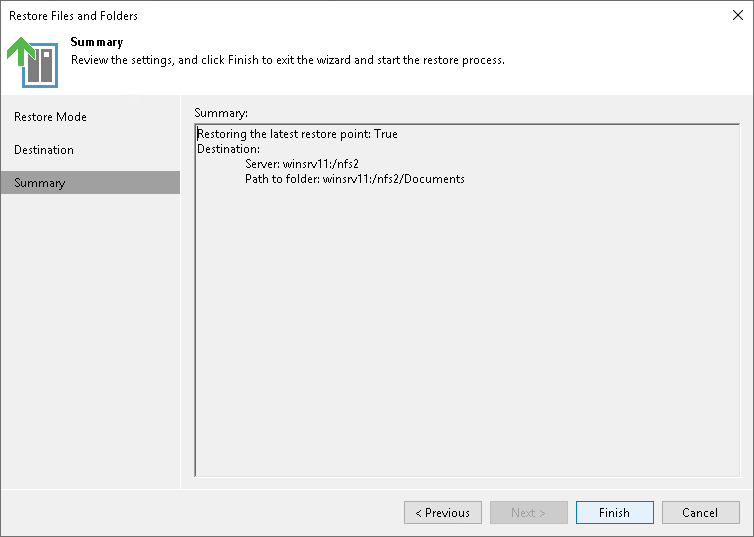

# Step 9. Finish Working with Wizard

In this article

At the Summary step of the wizard, review the file restore settings and click Finish.

Page updated 11/3/2023

Page content applies to build 13.0.1.1071
