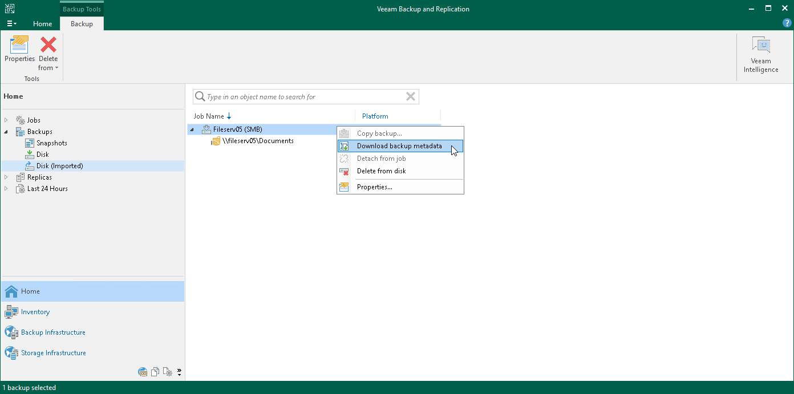

# Restoring Backup Files from Archive Repository

You can restore any file or folder from the archive repository to the state of any file version stored in the archive. Depending on the circumstances, such a restore can require different actions.

Regular Restore from Archive

To perform a regular restore from the archive repository when you have all required backup data stored both in the backup repository and archive repository, follow the instructions given in [Restoring Specific Files and Folders](file_share_recovery_restore_files_folders.md). Consider that to restore data from the archive repository, you must select the All Time option for [selecting files and folders to restore](restore_files_folders_backup_browser.md).

Emergency Restore from Archive

There can be different situations where backups are not available in the backup repository: for example, backup files are broken or deleted from the backup repository, backup configuration files are removed from the configuration, archive repository is added into backup infrastructure of another backup server, or backup archive is moved from one archive repository to another one. In these cases, you can restore specific files from the backup archive.

To restore files from the archive repository, for example, from an object storage:

1. If necessary, add the storage that keeps the required archive to the backup infrastructure as described in section [Adding Backup Repositories](repo_add.md).
2. Rescan the added archive repository as described in section [Rescanning Backup Repositories](rescanning_backup_repositories.md).
3. Download metadata for the archive backup:

1. Locate the required file backup archive under Backups > Object Storage (Imported) node in the Home view.
2. Right-click the file backup and select Download backup metadata.

1. From the drop-down list, select a backup repository to store the downloaded metadata of files archive and click OK.

1. Restore files from the archive backup as described in section [Restoring Specific Files and Folders](file_share_recovery_restore_files_folders.md).

