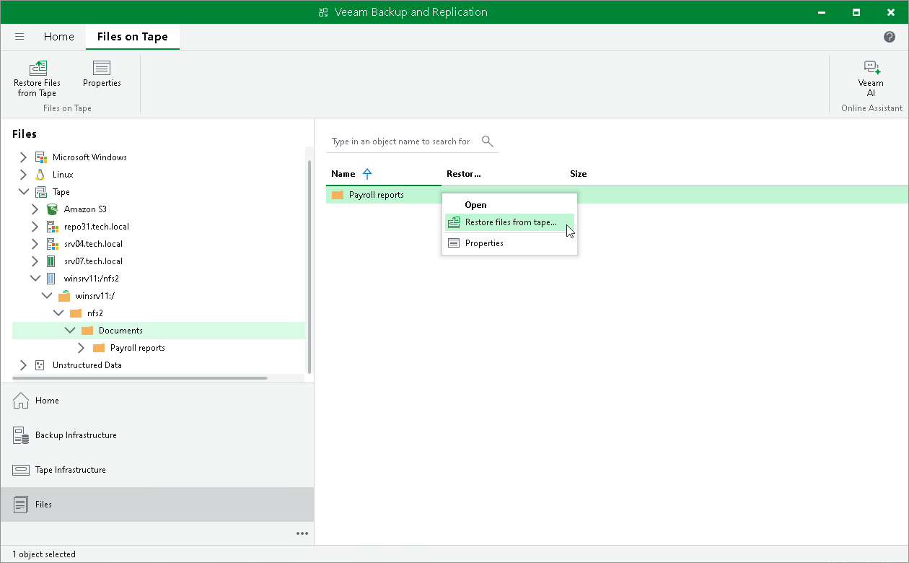
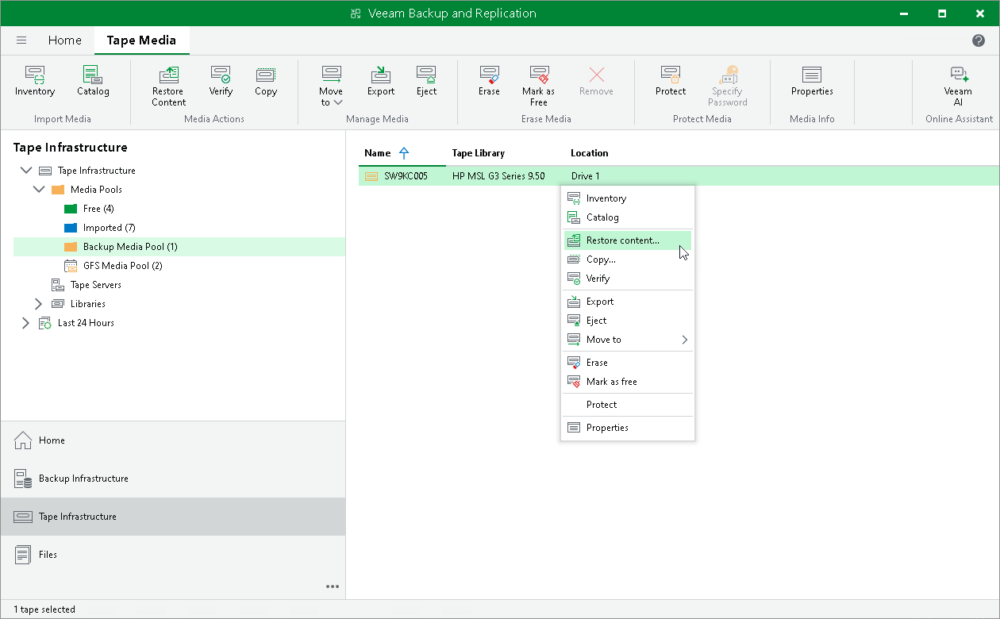

# Step 1. Launch Restore from Tape Wizard

The wizard may work in one of the two following modes:

* [Restoring files from tape](#restore_files_from_tape)
* [Restoring entire tapes](#restore_entire_tape)

Restoring Files from Tape

To run the Restore from Tape wizard, do either of the following:

* Open the Home tab and click Restore on the ribbon. Choose Tape > Restore Files.
* Open the Files view, expand the Tape node and browse to the necessary files on tape. Select the files and click Restore Files from Tape on the ribbon. Alternatively, you can right-click the files and choose Restore files from tape.

Restoring Entire Tapes

To launch the Restore from Tape wizard for restoring entire tapes, do the following:

1. Open the Tape Infrastructure view.
2. Navigate to the list of tapes either under Media Pools or under Libraries > LibraryName node > Media > Online.

|  |
| --- |
| Note |
| Tapes in the Unrecognized media pool are not available for data restore. |

1. Select the necessary tapes and click Restore Content on the ribbon. Alternatively, you can right-click the tape and select Restore content.

