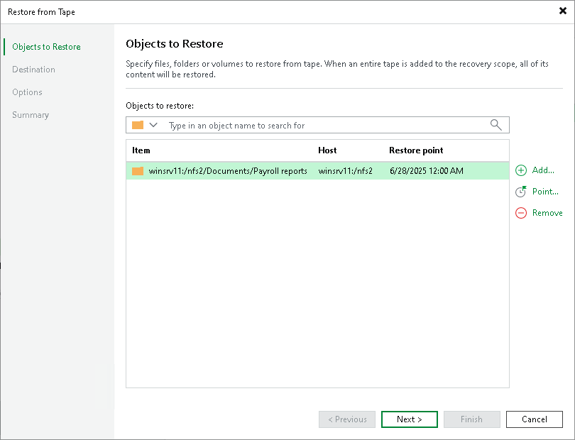
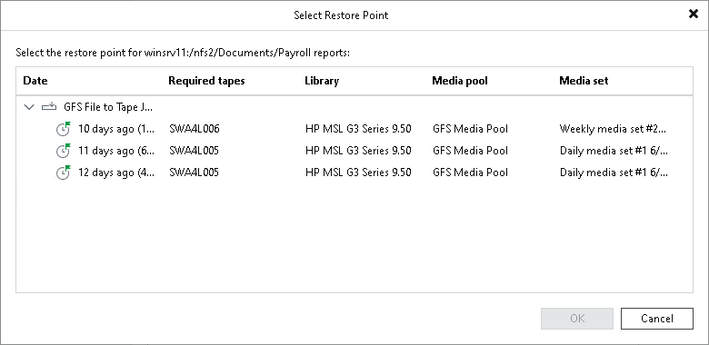
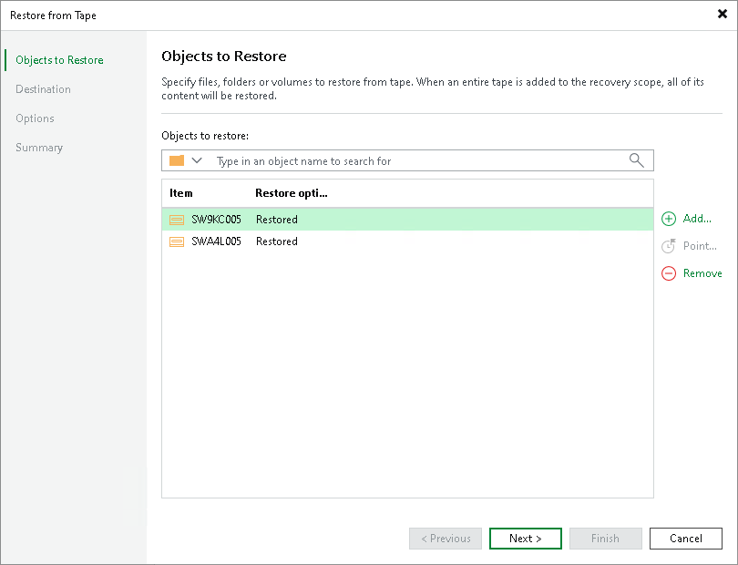

# Step 2. Choose Files to Restore

The objects to restore depend on the mode that the wizard is working in:

* [Restoring files from tape](#restore_files_from_tape)
* [Restoring entire tapes](#restore_entire_tapes)

Restoring Files from Tape

At the Objects to Restore step, choose data that you want to restore.

Click Add and browse to the file or folder, NDMP volume, or entire host (except for Linux) that you want to restore. The selected item will be added to the list. To quickly find file, folder or volume, use the search field at the top of the list: enter an object name or a part of it and click the search button on the right or press [Enter].

If you have chosen files to restore in the Files view, the list of objects to restore will be populated with selected files.

To remove a file or folder from the list, select it and click Remove.

|  |
| --- |
| Note |
| Consider the following:   * For one restore session, you can select only Microsoft Windows and Linux files, or NDMP volumes. * When restoring multiple NDMP volumes in one restore session, the restored volumes are merged into a single volume in the destination location. |

By default, Veeam Backup & Replication will restore the latest version of files or folders available on tape. If you want to restore files or folders from another restore point, select the necessary file or folder and click Point. In the list of available restore points, select the required one and click OK. If the file or folder are protected with more than one file to tape job, the restore points are grouped by jobs.

|  |
| --- |
| Note |
| For backups created with Veeam Backup & Replication 9.5 Update 3a and earlier: when you restore an entire folder from tape, Veeam Backup & Replication restores all files that have ever existed in the folder and been archived to tape. To restore files in the folder, Veeam Backup & Replication scans the selected backup set and backup sets that were created previously. If a file is not found in the selected backup set, Veeam Backup & Replication will restore the most recent version of the file from a backup set preceding the selected backup set. |

|  |
| --- |
| Note |
| Files written to tapes can be further removed from the source backup repository. Information about these removed files (about the fact that they are removed) is also written to tapes. If the tapes that store this information are rewritten as expired or erased by some reason, during the file restore from tape, Veeam Backup & Replication tries to restore the files removed from the source backup repository. Therefore, Veeam Backup & Replication can require even older tapes that store the copy of these removed files. |

Restoring Entire Tapes

At the Objects to Restore step of the wizard, select tapes to restore. The tape, which you selected when launching the wizard, is added to the list of tapes to restore by default. To add other tapes to restore, do the following:

1. Click Add. Veeam Backup & Replication opens the Select Tapes window listing all media pools and tapes in them available for restore.
2. In the Select Tapes window, navigate to the required media pool and select the tapes you want to restore.

When writing backup files to tapes, there can be situations when a file does not fit on a tape. Then it is divided into parts and written to several tapes, which are then considered dependent. Veeam Backup & Replication tracks this. When you are restoring data from a tape that contains only one part of the backup file, Veeam Backup & Replication detects that. It also informs you what tapes contain other parts of the file and prompts you to add these tapes to the list for restoring the full content. Note that tapes marked as Restored partially in the Restore Options column will be restored by Veeam Backup & Replication only partially: it will restore only data required for restoring full content of the initially selected tapes in the consistent manner.

To remove tapes from the restore list, select the tapes and click Remove.

