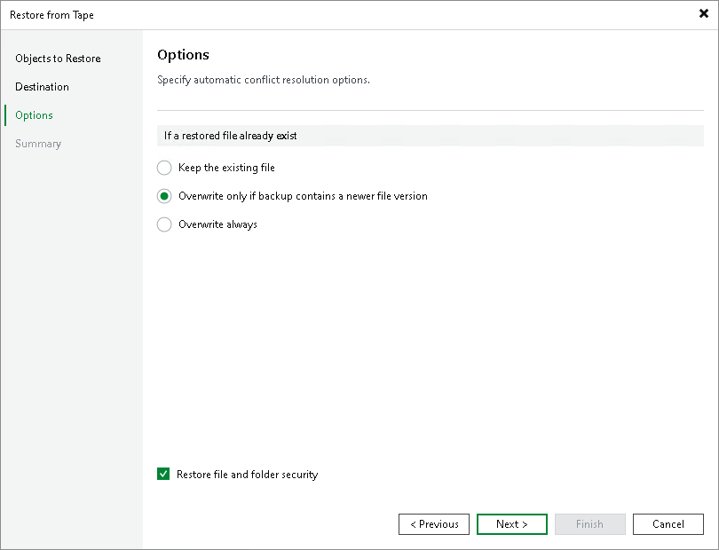

# Step 4. Specify Restore Options

At the Options step of the wizard, specify overwrite options in case the file already exists in the target folder:

* Keep the existing file. Select this option if you do not want to overwrite the existing file with the restored one.
* Overwrite only if backup contains a newer file version. Select this option if you want to overwrite the existing file only if it is older than the restored file.
* Overwrite always. Select this option if you want to overwrite the existing file with the restored file in all cases.

|  |
| --- |
| Note |
| Overwrite options are not available when restoring content of entire tapes. |

Select the Restore file and folder security check box if you want the restored files to keep their original ownership and security permissions. In the opposite case, Veeam Backup & Replication will change security settings: the user account under which the Veeam Backup Service runs will be set as the owner of the restored objects, while access permissions will be inherited from the target folder to which the objects are restored.

|  |
| --- |
| Note |
| This step is inapplicable for NMDP restore. If you restore NMDP volumes, these options will be skipped. The NMDP volumes will be restored according to the hardware settings. |

