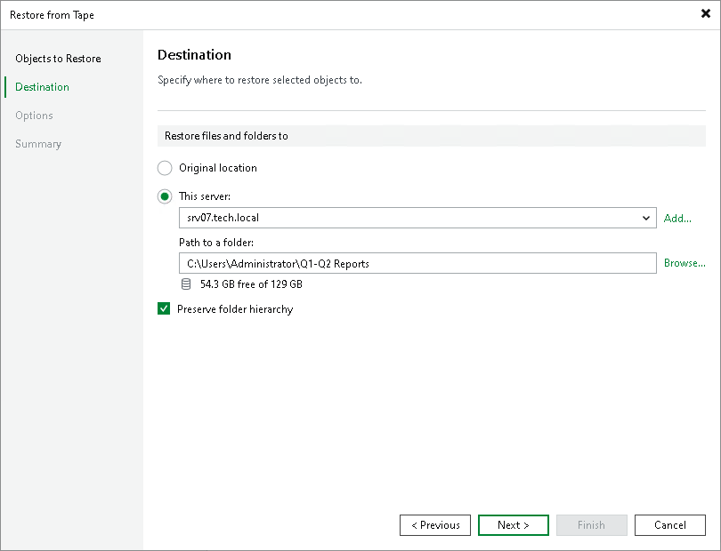

# Step 3. Specify Restore Destination

In this article

At the Destination step of the wizard, specify destination where the archived files will be restored. You can use one of the following options:

* Original location. Use this option to restore data to the location where the original file resides (or resided): Microsoft Windows server, Linux server, or NMDP server. This type of restore is only possible if the original machine is connected to Veeam Backup & Replication and powered on.

|  |
| --- |
| Note |
| Consider the following:   * If you are restoring content of the entire tapes, the Original location option is not available. * Restore to the original location is not supported for backups from NAS filers (NetApp Data ONTAP, Lenovo ThinkSystem DM/DG Series, Dell PowerScale or Nutanix Files Storage). |

* This server. Use this option if you want to restore data to another server. The following options are available:

* Microsoft Windows or Linux servers added to Veeam Backup & Replication as file servers: from the server list, choose a machine to which files should be restored and specify path to the target folder in the Path to a folder field. For more information on how to add file servers, see [Adding File Server](tape_adding_file_server.md).

If you choose to restore files to a shared folder, make sure that the account under which Veeam Backup Service runs has write permissions to the target folder. If the account does not have sufficient permissions, Veeam Backup & Replication will prompt you to enter credentials for the account that can be used for writing to the target folder.

* NDMP volumes: you can restore data to another NDMP server added to Veeam Backup & Replication. From the server list, select an NDMP server added to Veeam Backup & Replication. In the Path to a folder field, specify the volume to which you want to restore the archived volume.
* NAS file shares: you can restore data to an SMB (CIFS) or NFS file share. From the server list, select a NAS file share added to Veeam Backup & Replication. In the Path to a folder field, specify the folder to which you want to restore the archived files and folders.

When restoring files to a location other than original, Veeam Backup & Replication preserves the folder hierarchy. To restore files to the specified target folder without keeping the folder structure, clear the Preserve folder hierarchy check box. This option is unavailable for restore of NDMP volumes.

Page updated 7/9/2025

Page content applies to build 13.0.1.1071
