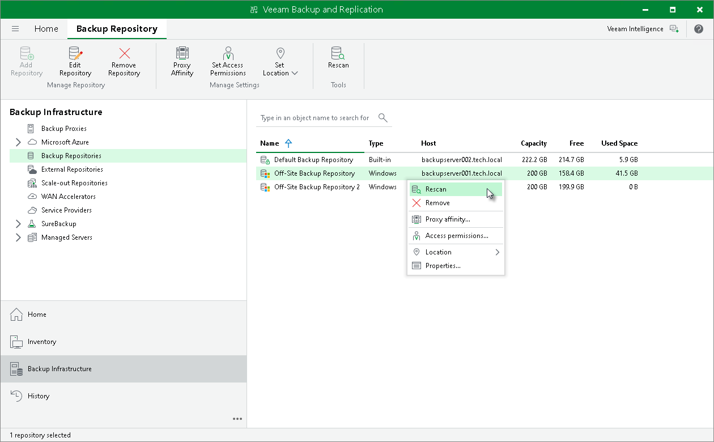

# Restore from Hardened Repository

In this article

As a result of malware activity or unplanned actions, backup job metadata files (.VACM) may become unavailable in the hardened repository. In such cases, to restore data from the hardened repository, Veeam Backup & Replication can regenerate the .VACM file based on information from the backup job storage metadata file (.VASM). The recovery process depends on whether the backup is still visible in the Veeam Backup & Replication console. Use the following procedure to restore backup availability in the Veeam Backup & Replication console.

Restoring Metadata Files by Rescanning the Backup Repository

You can restore backup availability by rescanning the backup repository in cases where a backup is not visible in the Veeam Backup & Replication console due to missing or corrupted metadata file (.VACM). In such cases, Veeam Backup & Replication detects any backup that is missing the .VACM file. For each affected backup, Veeam Backup & Replication regenerates the .VACM file based on information from the .VASM file and imports the backup automatically.

To restore metadata with a rescan operation, complete the following steps:

1. In the Veeam Backup & Replication console, open the Backup Infrastructure view.
2. In the inventory pane of the Backup Infrastructure view, select the Backup Repositories node.
3. In the working area, select the backup repository containing the required backup and click Rescan on the ribbon. Alternatively, you can right-click the backup repository and select Rescan.

As a result, the backup will appear in the Veeam Backup & Replication console as an imported backup. You can perform all available restore operations for imported backups with the newly imported backup.

Page updated 12/4/2025

Page content applies to build 13.0.1.1071
