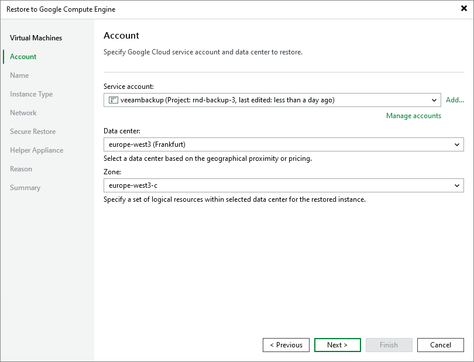

# Step 3. Specify Credentials and Datacenter Settings

In this article

At the Account step of the wizard, specify a Google Cloud service account, datacenter and availability zone to use for restore:

1. From the Service account list, select user credentials to connect to Google Compute Engine.

When you add credentials of the Google Cloud service account, Veeam Backup & Replication imports information about resources associated with this service account. During the restore process, Veeam Backup & Replication accesses these resources and uses them to create a target VM instance in Google Compute Engine.

If you have not set up credentials beforehand in the [Cloud Credentials Manager](cloud_credentials.md), click the Manage accounts link or click Add on the right to add the necessary credentials, as described in section [Google Cloud Service Accounts](cloud_credentials_gcp.md).

1. From the Data center list, select the Google Cloud datacenter where Veeam Backup & Replication will restore your workload as a VM instance.
2. From the Zone list, select the availability zone inside the Google Cloud datacenter where the restored workload will reside.

If you restore a Google Compute Engine VM instance from a backup created by Veeam Backup for Google Cloud to the same Google Cloud region where the instance is placed, after you click Next, the wizard will offer you to use region settings associated with this instance.

Page updated 8/22/2025

Page content applies to build 13.0.1.1071
