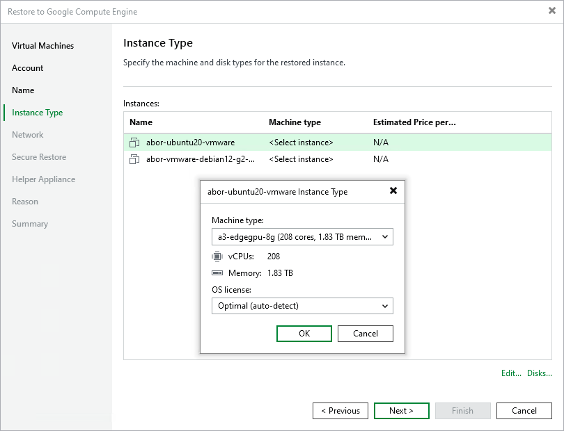

# Step 5. Specify Instance Type and Disks

In this article

At the Instance Type step of the wizard, select instance types and disk types for the restored workloads. By default, Veeam Backup & Replication restores all disks as Google Compute Engine disks of the Balanced persistent disk type. For information on types of Google Compute Engine disks, see the [Google Cloud documentation](https://cloud.google.com/compute/docs/disks).

Selecting Instance Type

You can select the amount of computing resources that Google Compute Engine will provision for your restored workload — a Google Compute Engine instance type. Each instance type offers a unique combination of CPU and memory resources.

To select an instance type for a workload:

1. In the Instances list, select a workload and click Edit.
2. From the Machine type list, select the instance type for the restored workload.

Make sure that you select the right instance type that corresponds to the initial workload configuration. For the information on instance types, see [Google Cloud Documentation](https://cloud.google.com/compute/docs/machine-types).

Note that if you restore a Google Compute Engine instance from the backup created by Veeam Backup for Google Cloud, Veeam Backup & Replication will identify the type of a backed-up instance and select it by default.

1. From the OS license list, select an option that will define what license Google Compute Engine will use for the OS on the restored workload:

* Optimal (auto-detect) — the OS license default for the workload OS will be used.
* Provided by GCE — the OS license will be provided by Google Compute Engine.
* Bring Your Own License (BYOL) — the OS license will be restored from the backup. For more information, see [Google Cloud documentation](https://cloud.google.com/compute/docs/nodes/bringing-your-own-licenses).

Selecting Disk Type

You can restore all disks or specific disks of a workload. You can also change disk types of the restored disks.

To select workload disks for restore:

1. In the Instances list, select a workload and click Disks.
2. In the Disks To Restore window, make sure that check boxes next to disks that you want to restore are selected. Clear check boxes next to disks that you do not want to restore.
3. Select a disk whose type you want to change and click Disk type.
4. In the Select Disk Type window, choose the disk type.

Page updated 8/22/2025

Page content applies to build 13.0.1.1071
