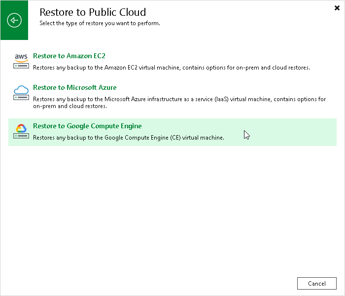

# Step 1. Launch Restore to Google Compute Engine Wizard

To begin the restore process, do one of the following.

* On the Home tab, click Restore and select the type of backups from which you want to restore:

+ VMware vSphere
+ VMware Cloud Director
+ Microsoft Hyper-V
+ Agent
+ AWS
+ Azure IaaS backup
+ GCE backup
+ Nutanix AHV
+ oVirt KVM
+ Proxmox VE
+ Scale Computing HyperCore

In the displayed window, click Entire VM restore > Restore to public cloud > Restore to Google Compute Engine.

* Open the Home view. In the inventory pane, click Backups. In the working area, expand the necessary backup, select workloads that you want to restore and click Entire VM > Google CE on the ribbon. Alternatively, you can right-click one of the workloads that you want to restore and select Restore entire VM > to Google CE.

