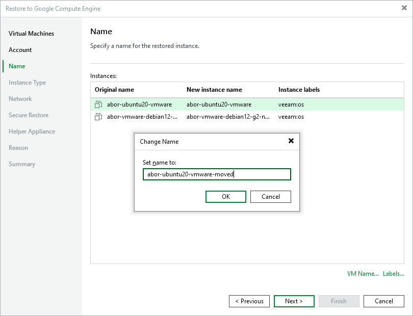
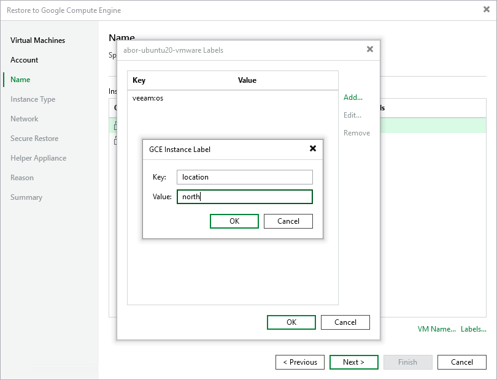

# Step 4. Specify Name and Labels

In this article

At the Name step of the wizard, you can specify names and manage Google labels for the restored workloads. By default, Veeam Backup & Replication uses original workload names.

Specifying New Name

To define a new name for a restored workload:

1. In the Instances list, select a workload and click VM Name.
2. In the Set name to field of the Change Name window, enter a new name for the restored workload.

Managing Google Cloud Labels

You can use Google Cloud labels to categorize instances in Google Compute Engine. A label is a tag with metadata that includes two properties: a key and a value. For more information on Google Cloud labels their format and limitations, see the [Google Cloud documentation](https://cloud.google.com/compute/docs/labeling-resources).

Adding Label

To add a new label:

1. In the Instances list, select a workload and click Labels.
2. In the Labels window, click Add.
3. In the GCE Instance Label window, specify the Key and Value properties.

Modifying Label

To modify a label:

1. In the Instances list, select a workload and click Labels.
2. In the Labels window, select the required label and click Edit.
3. In the GCE Instance Label window, edit the Key or Value properties.

Deleting Label

To delete a label:

1. In the Instances list, select a workload and click Labels.
2. In the Labels window, select the required label and click Remove.

Page updated 8/21/2025

Page content applies to build 13.0.1.1071
