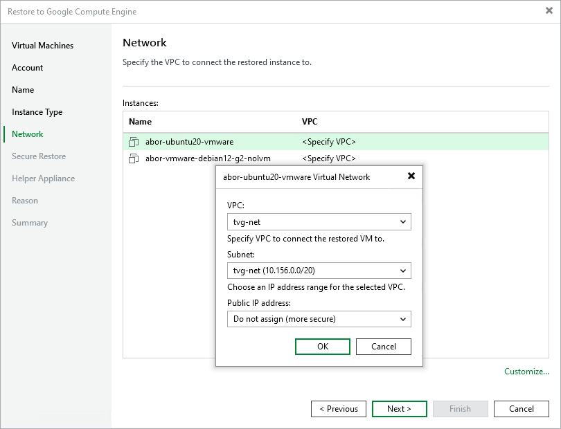

# Step 6. Select Google VPC

In this article

At the Network step of the wizard, you can select to which Google Virtual Private Cloud (Google VPC) network the workload must be connected after restore. You can also specify a subnet. For the information on Google VPC, see the [Google Cloud documentation](https://cloud.google.com/vpc/docs).

To define network settings for the restored workload, do the following:

1. In the Instances list, select a workload and click Customize.
2. From the VPC list, select the VPC where the restored workload will be launched.
3. From the Subnet list, select an IP address range for the selected VPC.
4. From the Public IP address list, select one of the following:

* Assign (restored VM will be accessible from the Internet) — if you want to assign a public IP to the restored workload. For security reasons, make sure firewall rules are properly configured in the target VPC.
* Do not assign (more secure) — if you do not want to assign a public IP.

Page updated 8/22/2025

Page content applies to build 13.0.1.1071
