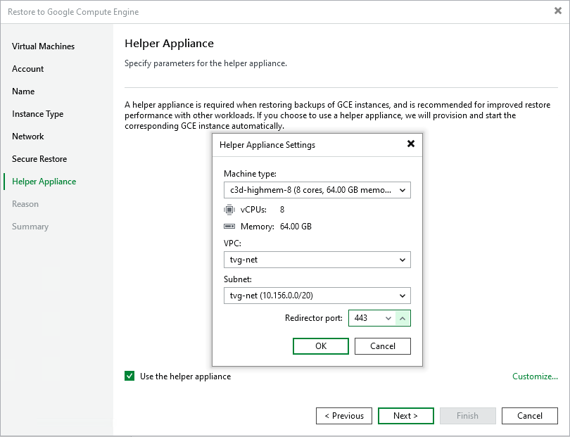

# Step 8. Configure Helper Appliance

In this article

At the Helper Appliance Settings step of the wizard, you can specify helper appliance settings. A helper appliance is an auxiliary Linux-based instance used to upload disks of a backed-up workload to Google Compute Engine. For more information on the helper appliance and requirements for it, see [Helper Appliances](restore_google_byb.md#happ).

To specify helper appliance settings, do the following:

1. Select the Use the helper appliance check box.
2. Click Customize.
3. From the Machine type list, select the instance type for the helper appliance.
4. From the VPC list, select the VPC network for the helper appliance.
5. From the Subnet list, select the subnet for the helper appliance.
6. In the Redirector port field, specify the port that Veeam Backup & Replication will use to route requests between the helper appliance and backup infrastructure components.

Page updated 12/30/2025

Page content applies to build 13.0.1.1071
