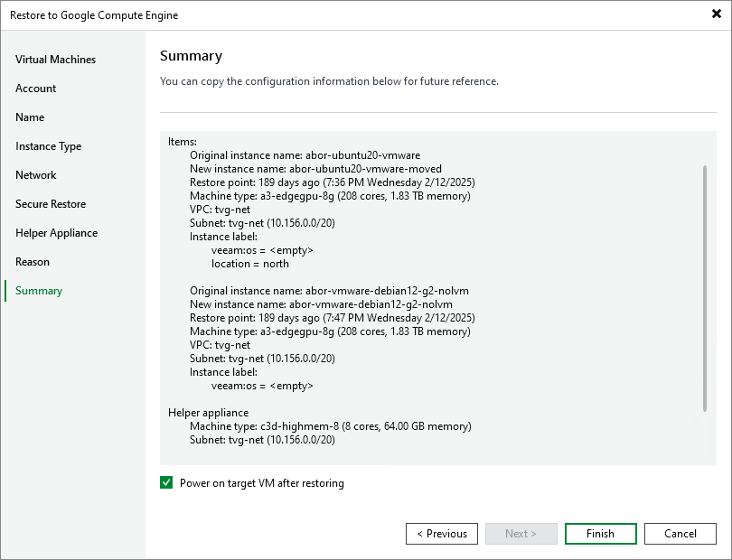

# Step 10. Verify Restore Settings

At the Ready to Restore step of the wizard, check the specified settings and click Finish. If you want to start the VM instance right after restore, select the Power on VM after restoring check box.

You can track the restore process in the Restore Session window. If you need to cancel the workload restore, click the Cancel restore task link.

