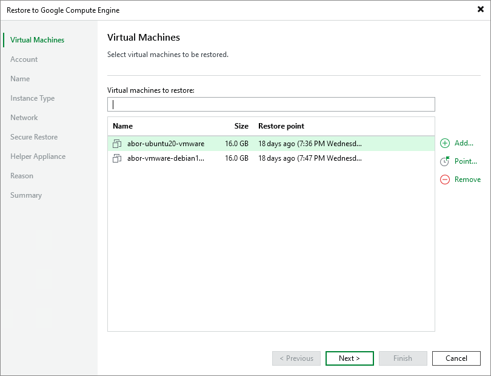
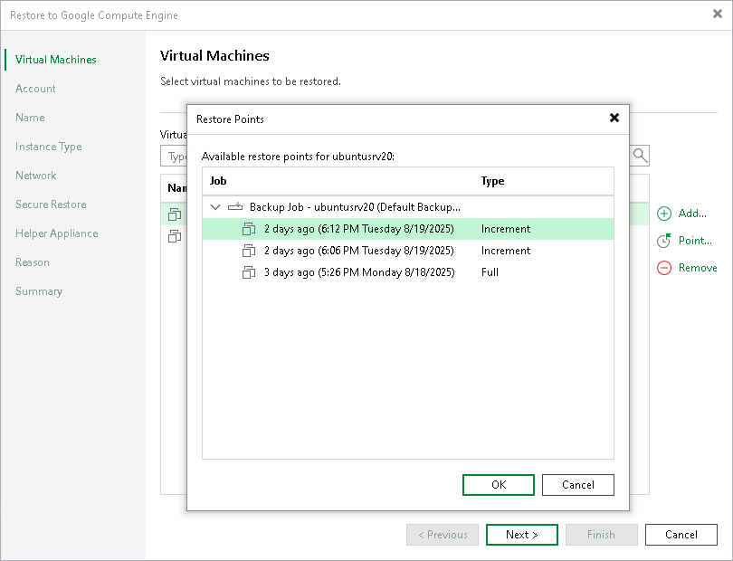

# Step 2. Select Workloads and Restore Points

At the Virtual Machines step of the wizard, specify the workload that you plan to restore and specify a restore point to which you want to restore the workload. By default, Veeam Backup & Replication restores workloads to the latest valid restore point in the backup chain.

Selecting Workloads

To select workloads to restore:

1. On the right of the Virtual machines to restore list, click Add.
2. In the Backup Browser window, expand the necessary backup, select workloads and click Add.

Selecting Restore Points

To select a restore point, for a workload do the following:

1. In the Virtual machines to restore list, select a workload.
2. Click Point on the right.
3. In the Restore Points window, select a restore point to which you want to restore the workload.

