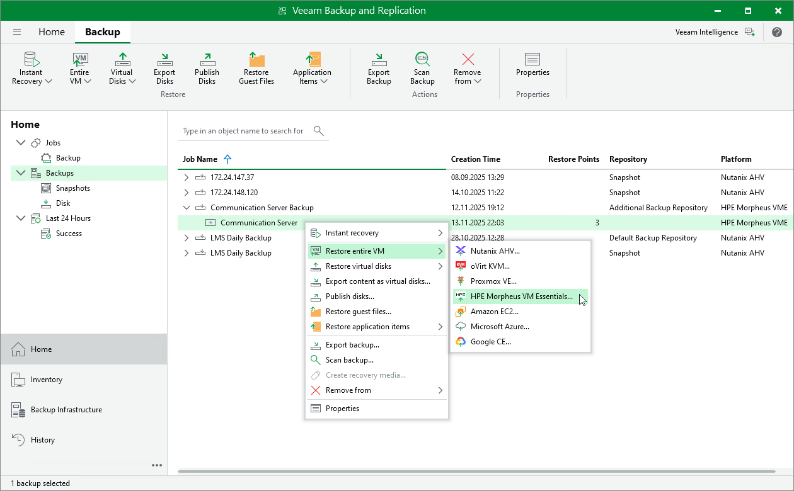

# Restore to HPE Morpheus VM Essentials

Veeam Backup & Replication allows you to recover different workloads as HPE Morpheus VM Essentials VMs.

Supported Backup Types

To restore workloads to HPE Morpheus VM Essentials, you can use the following backups:

* Backups of VMware vSphere virtual machines created by Veeam Backup & Replication
* Backups of VMware Cloud Director virtual machines created by Veeam Backup & Replication
* Backups of Microsoft Hyper-V virtual machines created by Veeam Backup & Replication

* Backups of virtual and physical machines created by [Veeam Agent for Microsoft Windows or Veeam Agent for Linux](agents_introduction.md)

* Backups of Nutanix AHV virtual machines created by [Veeam Plug-In for Nutanix AHV](https://helpcenter.veeam.com/docs/vbahv/userguide/overview.html?ver=9)
* Backups of Amazon EC2 instances created by [Veeam Backup for AWS](https://helpcenter.veeam.com/docs/vbaws/guide/overview.html?ver=10)
* Backups of Microsoft Azure virtual machines created by [Veeam Backup for Microsoft Azure](https://helpcenter.veeam.com/docs/vbazure/guide/overview.html?ver=8.1)
* Backups of Google Compute Engine VM instances created by [Veeam Backup for Google Cloud](https://helpcenter.veeam.com/docs/vbgc/guide/welcome.html?ver=7)\*

* Backups of oVirt VMs created by [Veeam Plug-In for oVirt KVM](https://helpcenter.veeam.com/docs/vbrhv/userguide/overview.html?ver=7)\*
* Backups of Proxmox VE VMs created by [Veeam Plug-In for Proxmox VE](https://helpcenter.veeam.com/docs/vbproxmoxve/userguide/overview.html?ver=3)

* Backups of Scale Computing HyperCore VMs created by [Veeam Plug-in for Scale Computing HyperCore](https://helpcenter.veeam.com/docs/vpsch/userguide/overview.html?ver=2)

* Backups of HPE Morpheus VM Essentials VMs created by [Veeam Plug-in for HPE Morpheus VM Essentials](hpe_morpheus_vme.md)

Performing Restore to HPE Morpheus VM Essentials

The restore procedure of entire workloads to HPE Morpheus VM Essentials practically does not differ from the procedure described in [Performing VM Restore to HPE Morpheus VM Essentials](hpe_restore_entire_vm.md).

