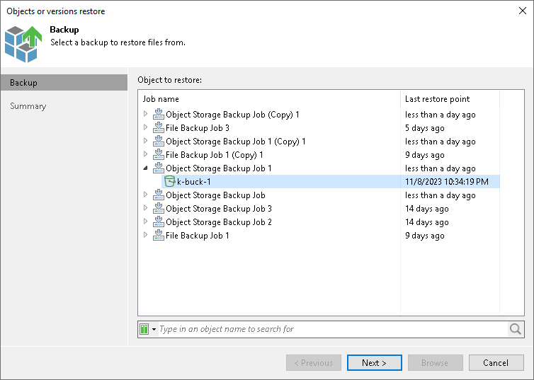

# Step 2. Select Object to Restore

In this article

At the Backup step of the wizard, select the bucket or container you want to restore:

1. In the Object to restore list, expand the necessary backup job.
2. Select the bucket or container.

To quickly find a bucket or container, you can use the search field at the bottom of the window.

1. Enter a bucket or container name or a part of it in the search field.
2. Click the Start search button on the right or press [Enter].

Page updated 11/27/2023

Page content applies to build 13.0.1.1071
