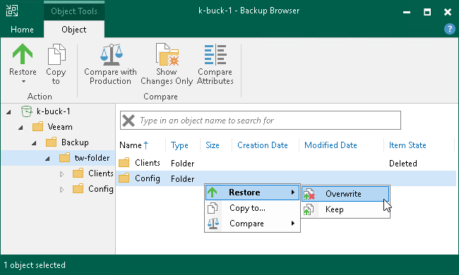
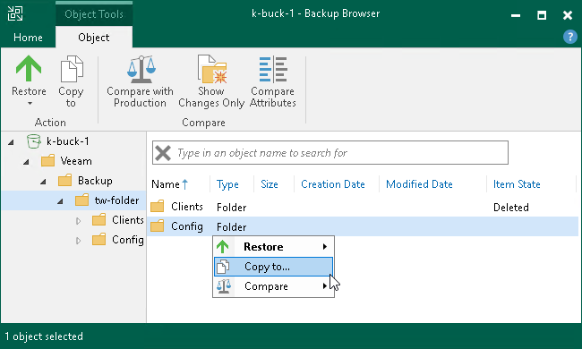
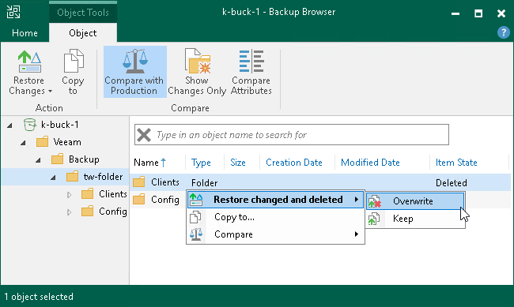
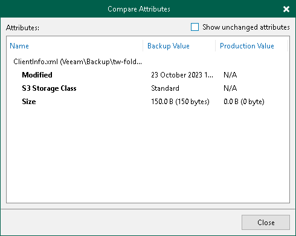

# Step 4. Select Objects to Restore

In the Backup Browser, select objects and prefixes to restore. Backup browser has three representations of restore points. You can select one of the following options in the Restore point group on the ribbon to display object versions:

* Latest — the Backup Browser shows the latest versions of objects and prefixes in the bucket or container.
* All Time — the Backup Browser shows all objects and prefixes ever backed up by the backup job. This option retrieves object versions stored both in the backup and archive repositories. This representation additionally shows how many object versions of each object are stored in the backup and the date when the latest object version was created.

After you select this option:

* If you restore a whole prefix, you will be prompted to the [Select Restore Mode](restore_individual_objects_restore_mode.md) step to select a restore mode and restore point to restore objects from.

|  |
| --- |
| Note |
| Consider that during object-level restore you cannot restore whole prefixes from the archive restore points. If objects and prefixes are already moved to the archive repository, you have to restore only objects one by one. |

* If you restore a single object, you will be prompted to the [Select Object Version to Restore](restore_individual_objects_object_version.md) step to select a object version to restore the object from.

* Selected — the Backup Browser shows versions of objects and prefixes backed up as of the certain restore point. Select the restore point in the list on the right of the Selected option on the ribbon.

You can use the search field at the top of the working area to search for specific objects and prefixes.

|  |
| --- |
| Note |
| To keep the operation of the Backup Server stable, the number of retrieved search result records is limited to 1000. Therefore, if you work with backup prefixes that store large volumes of data, it is recommended to narrow the search criteria to fit into the limitation. |

You can restore objects and prefixes to their original location or a new location.

Restoring Objects and Prefixes to Original Location

To restore objects and prefixes to the original location, in the Veeam Backup browser right-click an object or prefix and select one of the following commands:

* To overwrite the original object in the object storage with the object restored from the backup, select Restore > Overwrite.
* To save the object restored from the backup next to the original object, select Restore > Keep.

Veeam Backup & Replication will add the \_RESTORED\_YYYYMMDD\_HHMMSS suffix to the original object name and store the restored object in the same prefix where the original object resides.

Alternatively, you may use similar options under Restore in the ribbon.

Saving Objects and Prefixes to New Location

To save objects and prefixes to a new location, right-click the necessary object or prefix and select Copy to. Alternatively, you may use the Copy to option in the ribbon.

If you restore objects and prefixes to a new location, you will be prompted to the [Specify Destination for Object Restore](restore_individual_objects_destination.md) step to specify a new destination.

Comparing Backup Object and Prefix Versions with Production Objects and Prefixes

|  |
| --- |
| Important |
| Running the operations of the compare with production feature for backups of object storage requires sending HEAD and GET requests to the storage. That may lead to additional costs. |

|  |
| --- |
| Note |
| The compare with production feature does not work if you select the All Time option at the Home tab of the Backup Browser. |

You can compare backup versions of specific objects and prefixes with their production sources. To compare them, do the following:

1. Select an object or prefix in the items tree in the left pane or object in the right pane. You can use [Ctrl] to select multiple objects and prefixes in the right pane.
2. Click Compare with Production on the ribbon. Alternatively, you can right-click the necessary object or prefix and select Compare > Compare.

After the comparison, objects will have the following comparison states in the Item State column: changed, unchanged, deleted, comparing or failed to compare. The states are updated when you turn off and then turn on the comparison mode, and when you start restoring changes of objects. Note that when comparing symbolic links, Veeam Backup & Replication compares attributes of the links, not the attributes of objects which the symbolic link points to.

|  |
| --- |
| Tip |
| Consider the following:   * To show only changed objects (in the changed and deleted states), perform the compare operation, right-click any area in the Veeam Backup browser and select Compare > Show changes only or click Show Changes Only on the ribbon.  * To switch off the comparison states, select an object in the comparison state and click Compare > Compare or click Compare with Production on the ribbon. Note that if you switch off comparison for child objects, comparison for parent objects will also be switched off. |

Restoring Changed Objects and Prefixes

After you filter the changed objects and prefixes, you can restore them.

To restore changed and deleted objects and prefixes to the original location, do the following:

1. In the Veeam Backup browser right-click an object or prefix with Changed or Deleted item state.
2. Select one of the following commands:

* To overwrite the original object or prefix on the object storage with the object restored from the backup, select Restore changed and deleted > Overwrite.
* To save the object or prefix restored from the backup next to the original object, select Restore changed and deleted > Keep.

Veeam Backup & Replication will add the \_RESTORED\_YYYYMMDD\_HHMMSS suffix to the original object and prefix name and store the restored object and prefix where the original object and prefix resides.

Alternatively, you may use similar options under the Restore changes group in the ribbon.

You can also compare attributes of the changed and deleted objects and prefixes against objects and prefixes in the source object storage. To compare them, do the following:

1. Select a prefix in the items tree in the left pane or an object and the prefix in the right pane. You can use [Ctrl] to select multiple objects and prefixes in the right pane.
2. Right-click one of the selected items and select Compare > Compare attributes or click Compare Attributes on the ribbon. Alternatively, you can right-click one of the selected items and select Compare > Compare or click Compare with Production on the ribbon.

In the Compare Attributes window, Veeam Backup & Replication shows changed attributes. If you want to show all attributes, click the Show unchanged attributes check box at the top right corner. Note that Veeam Backup & Replication shows attributes maximum for 500 objects and prefixes and shows attributes for the selected objects, not for the nested objects.

