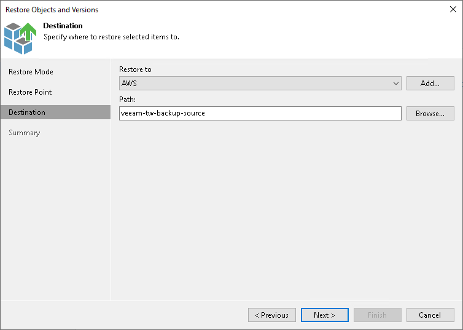

# Step 8. Specify Destination for Object Restore

The Destination step is required if you choose the Copy To option at the [Select Objects to Restore](restore_individual_objects_browser.md) step. Specify the destination where the restored objects must be stored:

1. In the Restore to field, select an unstructured data storage to which the objects must be restored. All unstructured data sources added to the inventory of Veeam Backup & Replication are available. If the required object storage is missing in the drop-down list, click Add and add the necessary object storage to Veeam Backup & Replication, as described in the [Adding Unstructured Data Source](adding_unstructured_data_source.md) section.
2. In the Path field, specify a bucket or container in the selected object storage or a path to the prefix in the selected object storage where objects must be restored.

To select a dedicated prefix for restored objects, click Browse. In the Select Folder window, select the target location.

