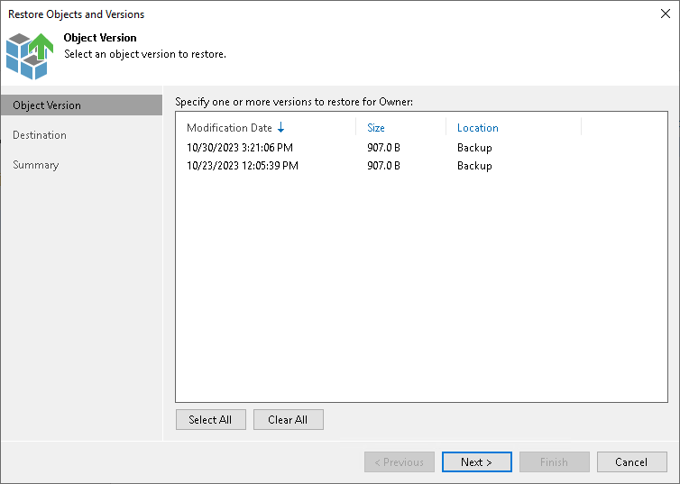

# Step 7. Select Object Version to Restore

The Object Version step is required if you use the All Time option at the [Select Objects to Restore](restore_individual_objects_browser.md) step and the selected objects have more than one object version.

Select one or more versions to restore. You can restore objects both from the backup repository and archive repository. To select several object versions, hold [Ctrl] and select multiple records in the table. Restore of multiple object versions can be helpful, for example, when you need to search for a specific version of the object, but you do not know for sure which one contains required changes.

