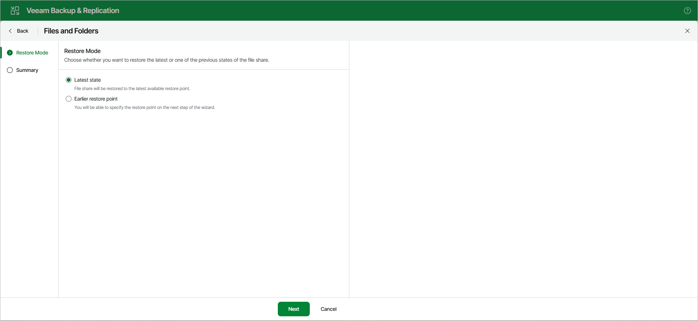

# Step 3. Select Restore Mode

The Restore Mode step is required if you use the All Time option at the [Select Objects to Restore](restore_individual_objects_browser_web.md) step and the selected prefixes have more than one restore point.

Choose to what point you want to restore prefixes:

* To restore the prefixes to the latest available restore point, select Latest state.
* To select a specific restore point, select Earlier restore point.

Choosing this option will open the [Restore Point](restore_individual_objects_restore_point_web.md) step.

Page updated 2026-07-27

