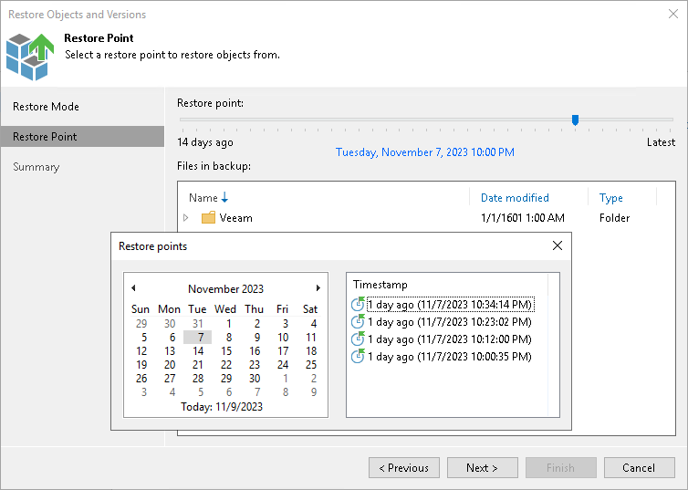

# Step 6. Select Restore Point

The Restore Point step is required if you use the All Time option at the [Select Objects to Restore](restore_individual_objects_browser.md) step, the selected prefixes have more than one restore point, and you select the Earlier restore point option at the [Restore Mode](restore_individual_objects_restore_mode.md) step.

At the Restore Point step of the wizard, select the point in time to restore prefixes to. To select the required restore point, do one of the following:

* Use the Restore point slider.
* Click the date link under the Restore point slider. In the calendar in the left pane of the Restore points window, select the date when the required restore point was created. The list of restore points in the right pane displays restore points created on the selected date. Select the point to which you want to restore the objects and prefixes.

In the Files in backup tree, you can see what objects and prefixes are covered by the selected restore point and the date when object and prefixes were modified.

