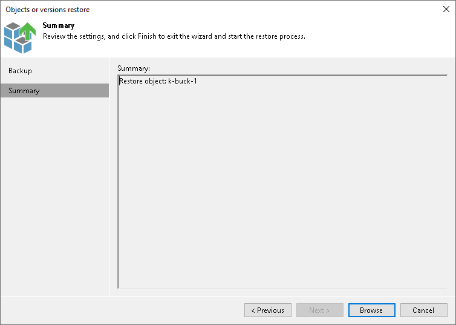

# Step 3. Verify Object Restore Settings

In this article

At the Summary step of the wizard, review the selected bucket or container and click Browse to switch to the [Backup Browser](restore_individual_objects_browser.md) step and select objects to restore.

Page updated 11/27/2023

Page content applies to build 13.0.1.1071
