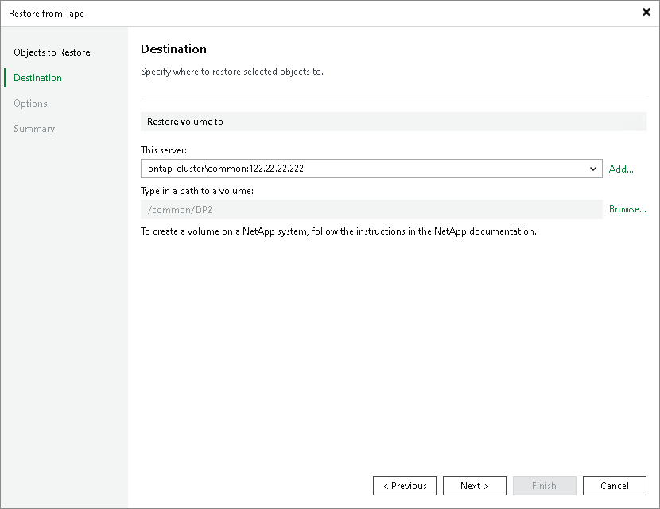

# Step 3. Specify Restore Destination

|  |
| --- |
| Important |
| Before specifying the destination, you must create a new Data Protection (DP) volume in the target NetApp ONTAP server to be used as the destination. The DP volume must be in read-only mode. |

At the Destination step of the wizard, specify destination where the archived volumes will be restored:

1. In the This server field, select the NetApp NDMP server where the target DP volume is located. If the NetApp NDMP server is not added to the backup infrastructure yet, click Add to open the New NDMP Server wizard.
2. Click Browse next to the Type in a path to a volume field and select the target DP volume where the archived volume will be restored to.

Page updated 2026-07-08

