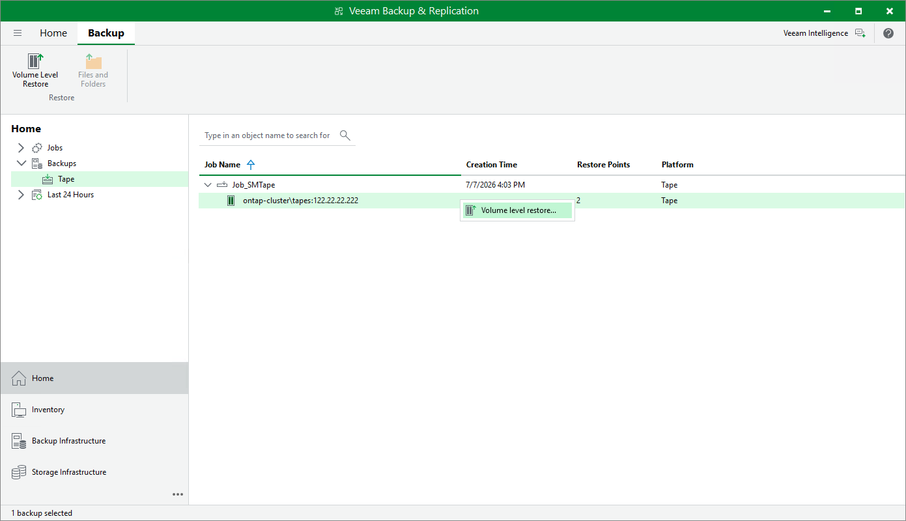

# Step 1. Launch Restore from Tape Wizard

To run the Restore from Tape wizard, do either of the following:

* Open the Home view, expand the Backups > Tape node and find the tape backup you want to restore. Select the necessary volume in the tape backup and click Volume Level Restore on the ribbon.
* Open the Home view, expand the Backups > Tape node and find the tape backup you want to restore. Right-click the necessary volume in the tape backup and choose Volume level restore.

Page updated 2026-07-08

