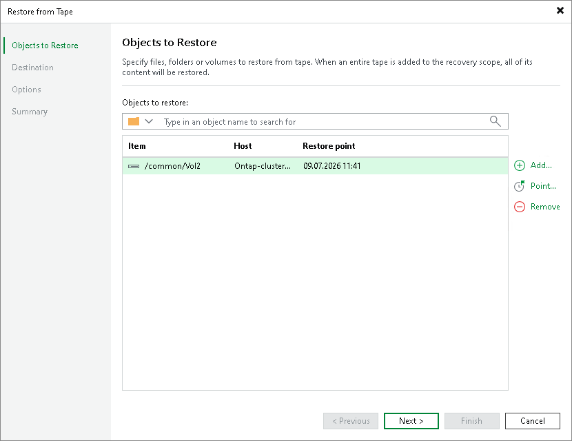

# Step 2. Choose Volumes to Restore

At the Objects to Restore step, choose data that you want to restore:

1. Click Add and browse to the NetApp NDMP volumes that you want to restore. The selected item will be added to the list. To quickly find a volume, use the search field at the top of the list: enter a volume name or a part of it and click the search button on the right or press [Enter].

To remove a volume from the list, select it and click Remove.

1. By default, Veeam Backup & Replication will restore the latest restore point of the volume available on tape. If you want to restore data from another restore point, select the volume in the Objects to restore list and click Point. In the list of available restore points, select the required one and click OK. If the file or folder are protected with more than one file to tape job, the restore points are grouped by jobs.

Page updated 2026-07-08

