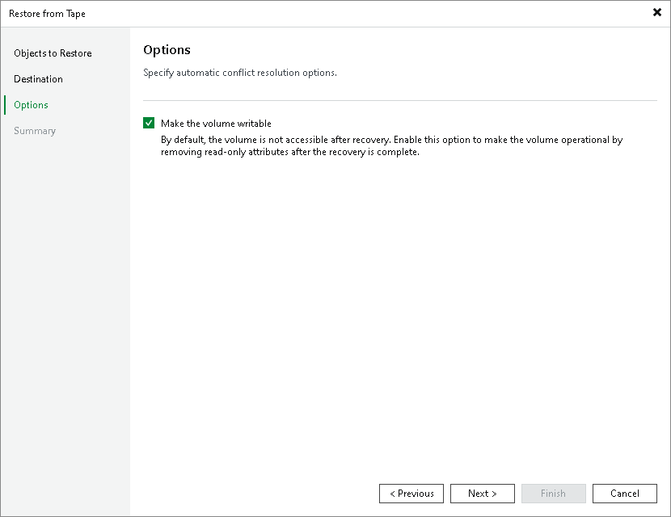

# Step 4. Specify Restore Options

At the Options step of the wizard, select the Make the volume writable check box if you want to switch the target DP volume to the read/write mode after the recovery is complete.

Page updated 2026-07-08

