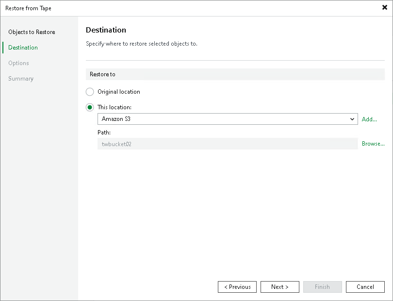

# Step 3. Specify Restore Destination

At the Destination step of the wizard, specify destination where the objects will be restored to. You can use one of the following options:

* Original location. Use this option to restore data to the original object storage location.

|  |
| --- |
| Note |
| If you choose to restore objects to the original location, the restored objects will have a new modification date. To back up the latest version of the objects, Veeam Backup & Replication will run a new full backup job once the restore procedure is done. |

* This location. Use this option to restore data to another server, bucket or object storage. The following options are available:

* Microsoft Windows or Linux servers added to Veeam Backup & Replication as file servers. From the server list, choose a machine to which objects should be restored to and specify path to the target folder in the Path field. For more information on how to add file servers, see [Adding File Server](tape_adding_file_server.md).
* Same object storage, different bucket: you can restore data to another existing bucket within the source object storage. From the list, select the source object storage and specify the bucket to which you want to restore the objects in the Path field.
* Another object storage: you can restore data to a different object storage added to Veeam Backup & Replication. Select the object storage in the list and specify the bucket to which you want to restore the objects in the Path field.
* NAS file shares: you can restore data to an SMB (CIFS) or NFS file share. From the list, select a NAS file share added to Veeam Backup & Replication. In the Path field, specify the folder to which you want to restore the archived files and folders.

|  |
| --- |
| Note |
| If you choose to restore objects to a different location, the restored objects will lose all storage specific attributes. |

