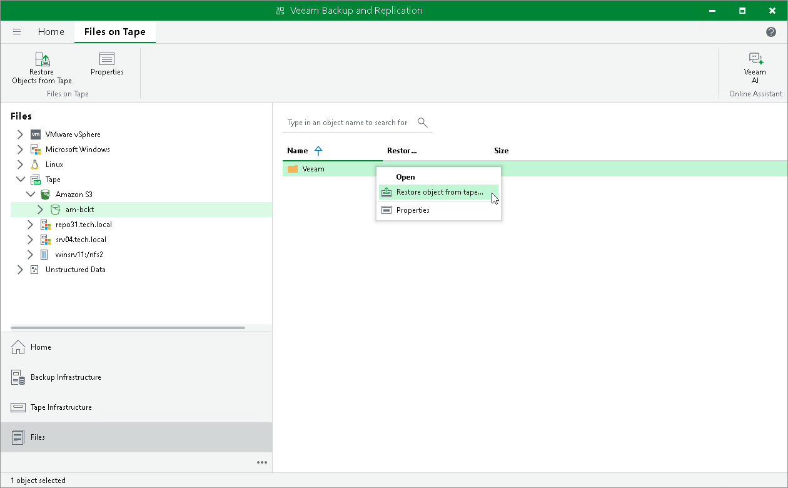
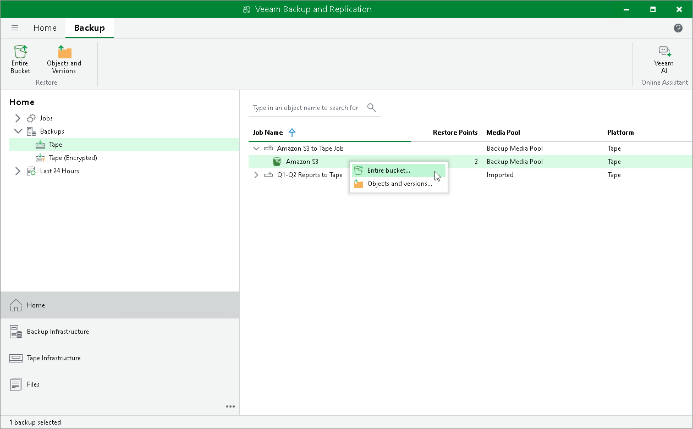

# Step 1. Launch Restore from Tape Wizard

In this article

You can use the Restore from Tape wizard in one of the two following modes:

* [Restoring objects and versions](#objects_versions)
* [Restoring entire bucket](#entire_bucket)

Restoring Objects and Versions

To launch the Restore from Tape wizard for restoring specific objects and versions, do one of the following:

* Open the Home tab and click Restore on the ribbon. Choose Tape > Restore Objects.
* Open the Files view, expand the Tape node and browse to the necessary objects on tape. Select the objects or prefixes and click Restore Objects from Tape on the ribbon. Alternatively, you can right-click the files and choose Restore objects from tape.
* Open the Home tab, expand the Backups node and click Tape. Select the necessary job in the working area and click Objects and Versions on the ribbon. Alternatively, you can right-click the job and choose Objects and Versions. Select the objects or prefixes and click Restore Objects from Tape on the ribbon.

Restoring Entire Bucket

To launch the Restore from Tape wizard for restoring entire object storage buckets, do the following:

1. Open the Home tab > Backups.
2. Navigate to the list of backup jobs under the Tape node and select the job containing the object storage bucket you want to restore.
3. Click Entire Bucket on the ribbon. Alternatively, you can right-click the job and choose Entire Bucket.

|  |
| --- |
| Note |
| You can restore the content of the entire bucket only to an existing bucket. Restoring to a new bucket is not available. |

Page updated 6/14/2024

Page content applies to build 13.0.1.1071
